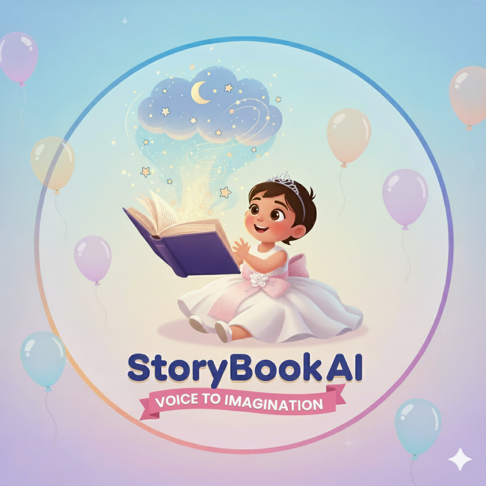

<p align="center">
  
</p>

# StoryBook AI ✨

**AI-Powered Storybook Adventure**

[](https://storybookai-backend.vercel.app/)

---

StoryBook AI is a magical web application that instantly generates children’s storybooks. Simply provide a story idea, and the AI creates a fully illustrated 5-page story with narration, transforming storytelling into an interactive, fun experience.

**Generative AI:** Google Gemini model—creates original, age-appropriate stories.

**Illustration AI:** Each story page receives a vibrant illustration using **Google Imagen** (via Gemini’s image generation API).

**Text-to-Speech:** The AI narrates each page in a cheerful, friendly voice for an immersive reading experience.

**Interactive UI:** Users can navigate through pages, view illustrations, and listen to narration.

---

## 🌟 Features

* **AI-Powered Story Generation:** Generates a full 5-page story from any prompt.
* **Illustrations for Each Page:** Vibrant watercolor-style AI-generated images using **Google Imagen**.
* **Narration:** AI reads each page aloud with a cheerful voice.
* **Interactive Storybook UI:** Navigate pages, play/stop narration.
* **Responsive Design:** Works beautifully on desktop and mobile devices.
* **Secure & Serverless:** API keys are hidden and never exposed to the client.

---

## 🔗 Live App

👉 [https://storybookai-backend.vercel.app/](https://storybookai-backend.vercel.app/)

---

## 🏗️ Architecture

StoryBook AI uses a modern serverless architecture for a seamless, secure experience:

```
User (Browser)
   │
   ▼
Frontend (HTML, Tailwind CSS, JavaScript)
   │
   ▼
Vercel Serverless API (Node.js)
   │
   ▼
Google Gemini API (Text & TTS) + Google Imagen (Image Generation)
```

**Architecture Details:**

* **Frontend (Client-Side):**

  * HTML, Tailwind CSS, and vanilla JavaScript.
  * Handles user input, story display, image rendering, and narration playback.

* **Backend (Serverless API on Vercel):**

  * Provides `/api/generate`, `/api/image`, and `/api/tts` endpoints.
  * Stores the Google Gemini API key securely.
  * Handles story generation, image creation (via Imagen), and narration requests.

* **Google Gemini API:**

  * **Story Generation:** `gemini-2.5-flash-preview-05-20`
  * **Text-to-Speech:** `gemini-2.5-flash-preview-tts`

* **Google Imagen API (via Gemini endpoints):**

  * Generates illustrations for each page based on descriptive prompts.
  * Produces vibrant, child-friendly watercolor-style images.

* **Flow:**

  1. User enters a story idea in the browser.
  2. Frontend calls the serverless API.
  3. Serverless API requests story, images, and audio from Google Gemini & Imagen.
  4. Response is returned to the frontend and displayed interactively.

---

## 🚀 Getting Started

1. **Clone the repository:**

```bash
git clone https://github.com/siddth09/storybookai-backend.git
cd storybookai-backend
```

2. **Install dependencies:**

```bash
npm install
```

3. **Set up environment variables:**

```bash
GEMINI_API_KEY=your_google_gemini_api_key
```

4. **Run locally:**

```bash
npm run dev
```

Open [http://localhost:3000](http://localhost:3000) in your browser.

5. **Deploy on Vercel:**

* Create a free Vercel account.
* Link your GitHub repository.
* Add `GEMINI_API_KEY` as an environment variable in the project settings.
* Vercel auto-deploys the app.

---

## 🛠️ Technologies Used

* **Frontend:** HTML, Tailwind CSS, Vanilla JavaScript
* **Backend:** Node.js, Vercel Serverless API
* **AI Services:** Google Gemini API (story generation & TTS), **Google Imagen** (image generation)
* **Hosting:** Vercel (free serverless deployment)

---

## 📄 License

MIT License © 2025
